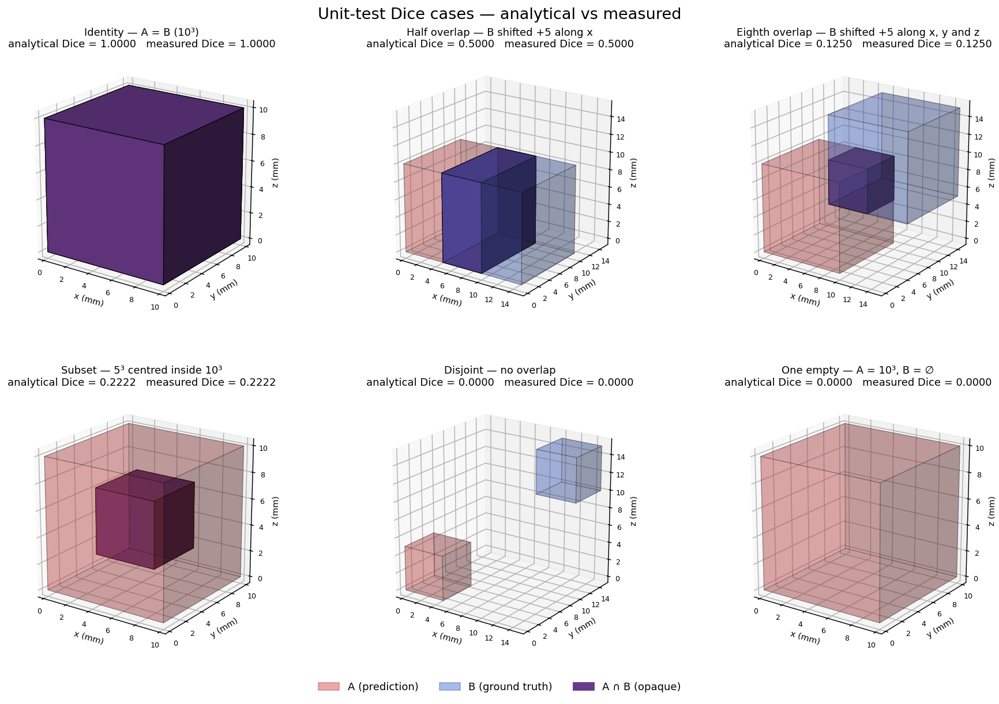
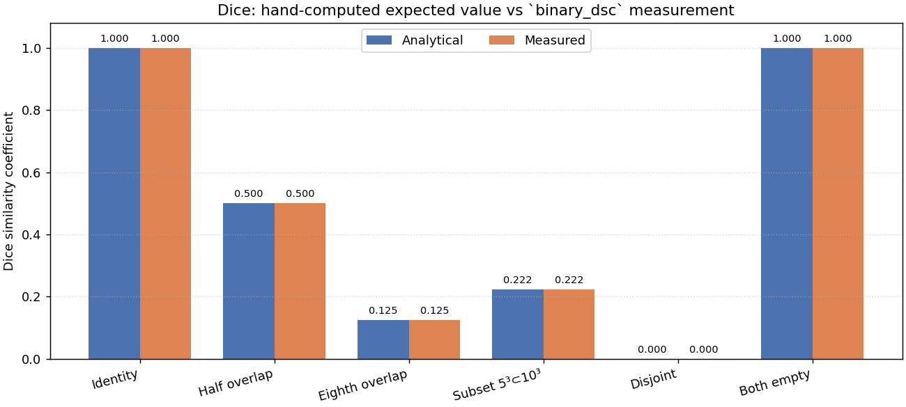
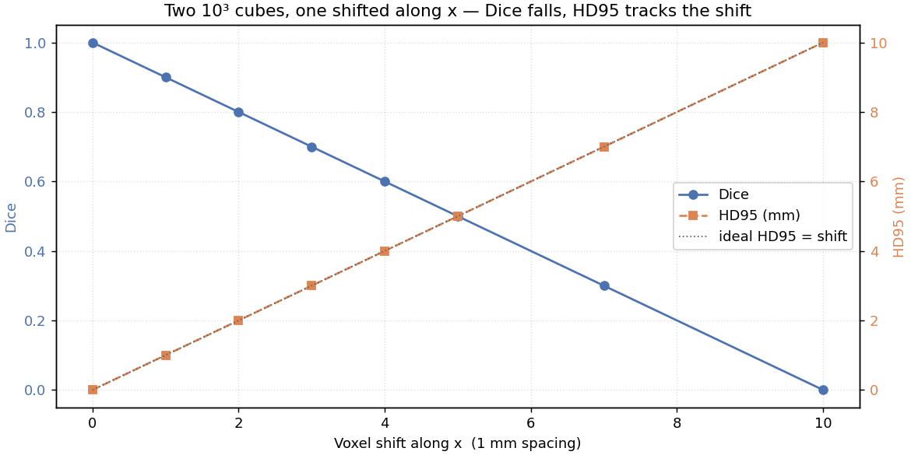
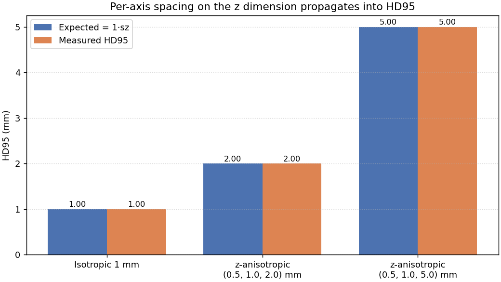
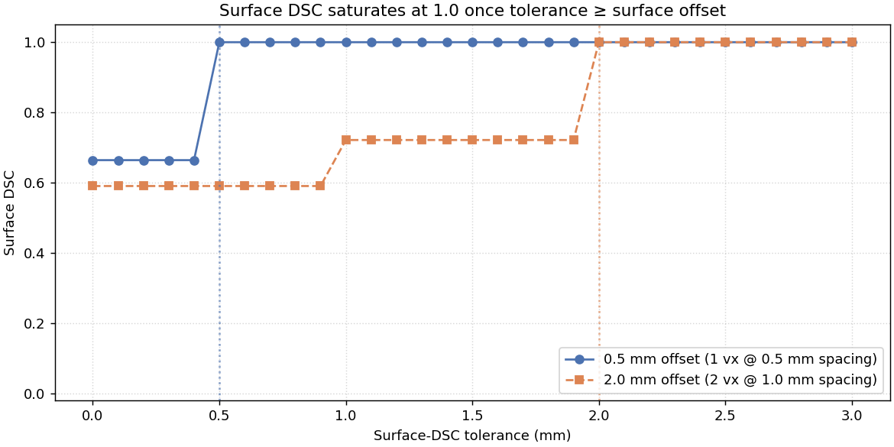
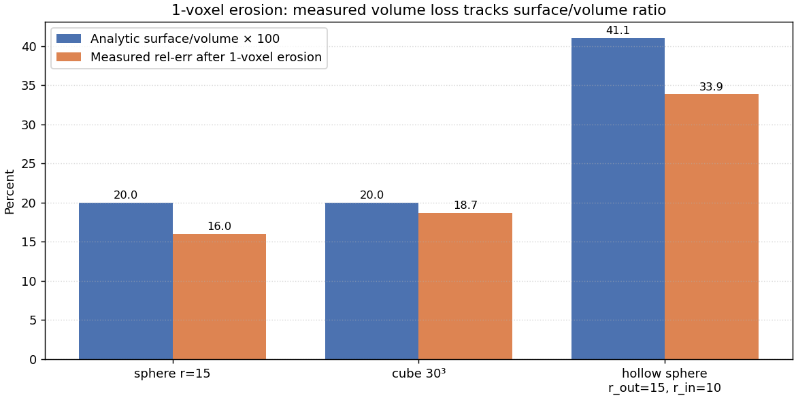

# Validating the validation suite

This page documents how the metrics inside `rtmask_conformance` are themselves
validated. Conformance gates are only as trustworthy as the math underneath
them — if `binary_dsc` silently regresses, every consumer's "Dice = 0.95
threshold" check goes with it. The tests in
[`src/rtmask_conformance/tests/`](../src/rtmask_conformance/tests) pin every
exposed metric against hand-computable expected values, and run on every CI
build under a clearly-named [Metric drift gate](../.github/workflows/ci.yml)
step.

> **All figures on this page are programmatically regenerated.** Run
> `python docs/validation/generate_figures.py` from the repo root after any
> change to the metric implementations — the bars and lines update from the
> live functions, so visual drift mirrors numeric drift.

## What we validate

Three exported metric functions, all in
[`src/rtmask_conformance/_vendor/metrics.py`](../src/rtmask_conformance/_vendor/metrics.py):

| Function | Returns |
|---|---|
| `binary_dsc(a, b)` | Dice similarity coefficient |
| `volume_metrics(a, b, voxel_volume_mm3)` | Tool & ref volumes, abs / rel error |
| `all_surface_metrics(a, b, voxel_size_mm, tolerance_mm)` | Surface DSC, HD, HD95, mean surface distance |

Each test below computes the expected value from first principles, calls the
metric on a small synthetic numpy array, and asserts equality.

---

## 1. Dice — discrete, hand-computable cases

Six configurations of axis-aligned cubes whose Dice is exactly recoverable
by counting voxels. The middle z-slice of each test array is rendered below;
red is the prediction `A`, blue is the ground truth `B`, purple is their
intersection.



The arithmetic for each:

| Case | Setup | Intersection / Sum | Analytical Dice |
|---|---|---|---|
| Identity | `A = B` (10³ cube) | 1000 / 2000 | **1.0000** |
| Half overlap | `B = A` shifted +5 vx along x | 500 / 2000 | **0.5000** |
| Eighth overlap | `B = A` shifted +5 vx along x, y, and z | 125 / 2000 | **0.1250** |
| Subset | 5³ cube centred inside `A` (10³) | 125 / 1125 | **0.2222** |
| Disjoint | two 5³ cubes far apart | 0 / 250 | **0.0000** |
| One empty | `A = 10³`, `B = ∅` | 0 / 1000 | **0.0000** |

The "both empty" case (`A = B = ∅`) is handled by convention in
[`binary_dsc:76-77`](../src/rtmask_conformance/_vendor/metrics.py): nothing
to disagree about returns 1.0.

The bar chart below pairs each analytical value against what `binary_dsc`
actually returns. Every pair sits flush — agreement to four decimal places
across every dtype the function accepts (`bool`, `uint8`, `uint16`, `int32`,
`float32`, see
[`test_dsc_dtype_independent`](../src/rtmask_conformance/tests/test_metric_math.py)).



---

## 2. Surface metrics behave under translation

Two identical 10³ cubes, one shifted along x by 0–10 voxels at 1 mm spacing.
Dice should fall linearly through 0 (no overlap once the shift exceeds the
cube's edge length); HD95 should track the shift exactly because the worst
displaced contour voxel is at the shift distance from its nearest match.



The dotted line is the *ideal* `HD95 = shift × spacing` relation; the
measured HD95 sits on it for every shift in the range. This is the
[`test_metrics_degrade_monotonically_with_shift`](../src/rtmask_conformance/tests/test_metric_math.py)
parametrised case made visible.

---

## 3. Spacing is honoured per-axis

A 1-voxel translation along z under three different voxel-size triples. If
the surface metric ignored per-axis spacing it would return ~1 mm for all
three; if it took the mean spacing it would return some compromise. The
measured value matches `1 × sz` exactly:



This is what the
[`test_surface_hd_respects_anisotropic_spacing_on_z`](../src/rtmask_conformance/tests/test_metric_math.py)
unit test asserts. It catches spacing-axis swaps directly — a class of bug
that is otherwise hard to spot because it produces plausible-looking numbers
on isotropic test data.

---

## 4. Surface DSC saturates at the tolerance threshold

Surface DSC counts the fraction of contour voxels that find a counterpart
within `tolerance_mm`. For a constant-offset shift, the answer is a step
function: 0 (or some baseline) below the offset distance, 1.0 above it. The
plot below sweeps tolerance from 0 to 3 mm for two configurations:

- 0.5 mm offset (1-voxel shift @ 0.5 mm spacing): saturates at tolerance ≈ 0.5
- 2.0 mm offset (2-voxel shift @ 1.0 mm spacing): saturates at tolerance ≈ 2.0



Vertical guides mark the offset distance — the curves jump to 1.0 at exactly
the right tolerance. Tested by
[`test_surface_dsc_within_tolerance_is_one`](../src/rtmask_conformance/tests/test_metric_math.py)
and `test_surface_dsc_beyond_tolerance_drops_below_one`.

The non-saturated baseline is non-zero because the *back* of each cube — the
faces orthogonal to the shift — are perfectly aligned regardless of offset,
so a fraction of the contour voxels match at any tolerance.

---

## 5. Volume error tracks surface-to-volume ratio under erosion

A 1-voxel binary erosion strips a thin shell off any solid mask. The volume
loss as a fraction of the original is approximately

  Δvolume / volume ≈ surface area / volume × voxel_size

so masks with high surface-to-volume ratio lose proportionally more.
Comparing three shapes:

| Shape | Surface (mm²) | Volume (mm³) | S/V × 100 |
|---|---:|---:|---:|
| sphere r=15 | 4π·15² ≈ 2,827 | (4/3)π·15³ ≈ 14,137 | 20.0 |
| cube 30³ | 6·30² = 5,400 | 27,000 | 20.0 |
| hollow sphere r_out=15, r_in=10 | 4π·(15² + 10²) ≈ 4,084 | (4/3)π·(15³ − 10³) ≈ 9,948 | 41.1 |



Measured rel-err (from `volume_metrics`) sits below the analytic S/V upper
bound but tracks the same ordering: the hollow sphere loses ~2× the relative
volume of the solids. This is the directional check
[`test_one_voxel_erosion_drives_volume_underreport`](../src/rtmask_conformance/tests/test_offset_overlap_e2e.py)
runs end-to-end on the seven shipped primitives.

---

## End-to-end gate: perturbed predictions on the real fixture

Beyond the small-cube unit tests, the
[`test_offset_overlap_e2e.py`](../src/rtmask_conformance/tests/test_offset_overlap_e2e.py)
suite exercises the full `verify_predictions` pipeline against the seven
analytic primitives the conformance suite ships. It generates one fixture
per pytest module and reuses it across:

| Test | Perturbation | What it pins |
|---|---|---|
| `test_baseline_ideal_predictions_score_perfect` | none | every ROI scores Dice ≥ 0.999 |
| `test_one_voxel_shift_produces_nontrivial_hd95` | `np.roll(±1 vx along x)` | HD95 ∈ [0.5, 3.0] mm per ROI |
| `test_dice_degrades_monotonically_with_larger_shift` | shifts of 0, 1, 3 vx | Dice and HD95 monotone in shift |
| `test_three_voxel_shift_fails_conformance` | 3 vx shift | every ROI status = `FAIL` |
| `test_one_voxel_erosion_drives_volume_underreport` | `binary_erosion` | every ROI under-reports volume |

The monotonicity check is the strongest cross-metric assertion: a regression
that swaps the operands of `binary_dsc` or breaks signed distance maps will
either invert the ordering between the three shifts or collapse them, in
ways that the per-case threshold tests would not always catch.

These are gated by `RTMASK_CONFORMANCE_SKIP_E2E=1` so they can be opted out
of in fast development loops; CI runs them on every push.

---

## How to re-run

```bash
# Fast unit tests only — these are the metric drift gate
pytest src/rtmask_conformance/tests/test_metric_math.py \
       src/rtmask_conformance/tests/test_evaluator_api.py -v

# Full suite including end-to-end perturbation tests (slow, ~5 min)
pytest src/rtmask_conformance/tests/ -v

# Regenerate the figures on this page
python docs/validation/generate_figures.py
```
